<h1 align="center">Windows Server Active Directory & IT Support Lab</h1>

  <strong>Enterprise-style Windows Server Administration Portfolio Project</strong> 
  Active Directory • DNS • Group Policy • File Server • NTFS • SMB • Access Control

  
  
  
  

<h2>1. Project Overview</h2>

This project simulates a small-to-medium enterprise Windows IT environment using
<strong>Windows Server</strong>. The objective was to build and document a centralized
infrastructure for identity management, security policy enforcement, departmental
resource management, and file sharing.

<h3>Primary Goals</h3>

<ul>
  <li>Deploy and configure a Windows Server Domain Controller.</li>
  <li>Build the <code>corp.local</code> Active Directory domain.</li>
  <li>Configure DNS for the domain.</li>
  <li>Organize departments using Organizational Units (OUs).</li>
  <li>Manage users through department-based security groups.</li>
  <li>Apply centralized password and account-lockout policies.</li>
  <li>Configure departmental file storage and SMB shares.</li>
  <li>Control access using NTFS permissions.</li>
  <li>Verify the implemented configuration with evidence.</li>
</ul>

<h2>2. Lab Environment</h2>

<table>
<tr><th>Component</th><th>Configuration</th></tr>
<tr><td><strong>Server</strong></td><td>Windows Server</td></tr>
<tr><td><strong>Server Name</strong></td><td><code>DC01</code></td></tr>
<tr><td><strong>Domain</strong></td><td><code>corp.local</code></td></tr>
<tr><td><strong>Directory Service</strong></td><td>Active Directory Domain Services</td></tr>
<tr><td><strong>DNS</strong></td><td>Windows DNS</td></tr>
<tr><td><strong>Virtualization</strong></td><td>Oracle VirtualBox</td></tr>
<tr><td><strong>File Sharing</strong></td><td>SMB</td></tr>
<tr><td><strong>Permissions</strong></td><td>NTFS</td></tr>
<tr><td><strong>Departments</strong></td><td>IT, HR, Finance, Sales, Management</td></tr>
</table>

<h2>3. Architecture</h2>

<pre>
                         +----------------------+
                         |    Windows Server    |
                         |        DC01          |
                         |      corp.local      |
                         +----------+-----------+
                                    |
              +---------------------+---------------------+
              |                     |                     |
       Active Directory            DNS              Group Policy
              |
        +-----+------+
        |            |
       OUs      Security Groups
        |            |
   +----+----+----+----+
   |    |    |    |    |
  IT   HR Finance Sales Management
        |
        +------------------+
                           |
                      File Server
                           |
                  Departmental Shares
</pre>

<h2>4. Implementation & Evidence</h2>

The following sections document the work in the order it was performed. Each
implementation is followed immediately by its corresponding evidence.

<h3>4.1 Windows Server Identity</h3>

<strong>What was done:</strong> Configured and verified the Windows Server that serves as the central infrastructure server for the lab.

<strong>Why it matters:</strong> A clearly identified infrastructure server provides a consistent foundation for centralized Windows administration.

<strong>Evidence:</strong>

  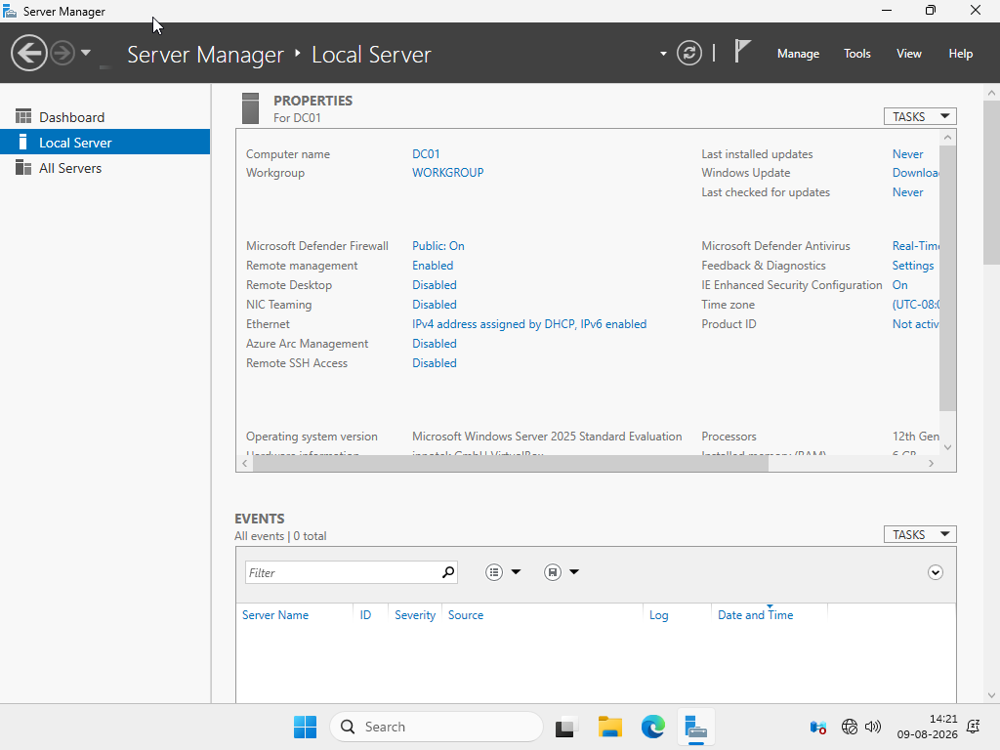

<em>Figure 1 — DC01 Server Identity</em>

<h3>4.2 Static IP Configuration</h3>

<strong>What was done:</strong> Configured and verified a static IP configuration for DC01.

<strong>Why it matters:</strong> Infrastructure services such as DNS and Active Directory should be reachable through a predictable server address.

<strong>Evidence:</strong>

  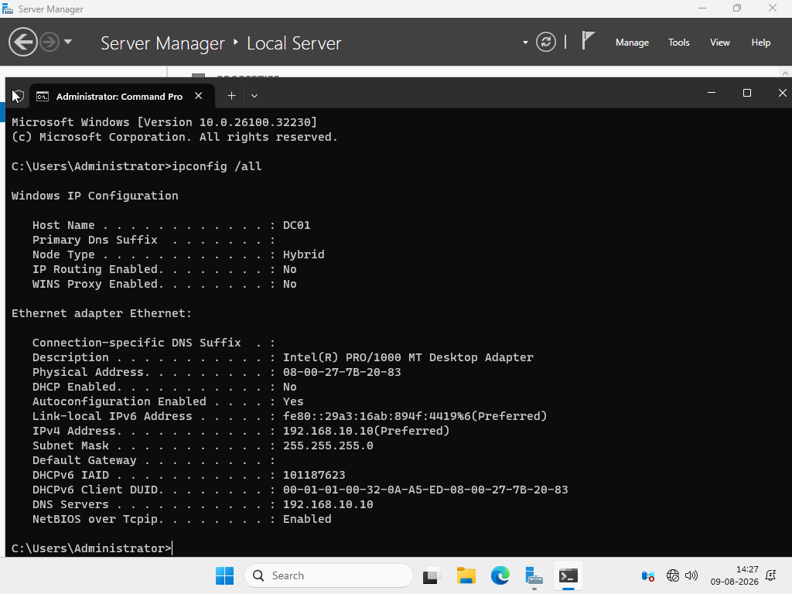

<em>Figure 2 — Static IP Verification</em>

<h3>4.3 Active Directory Domain</h3>

<strong>What was done:</strong> Configured the Active Directory domain <code>corp.local</code>.

<strong>Why it matters:</strong> The domain provides centralized identity, authentication, and policy management.

<strong>Evidence:</strong>

  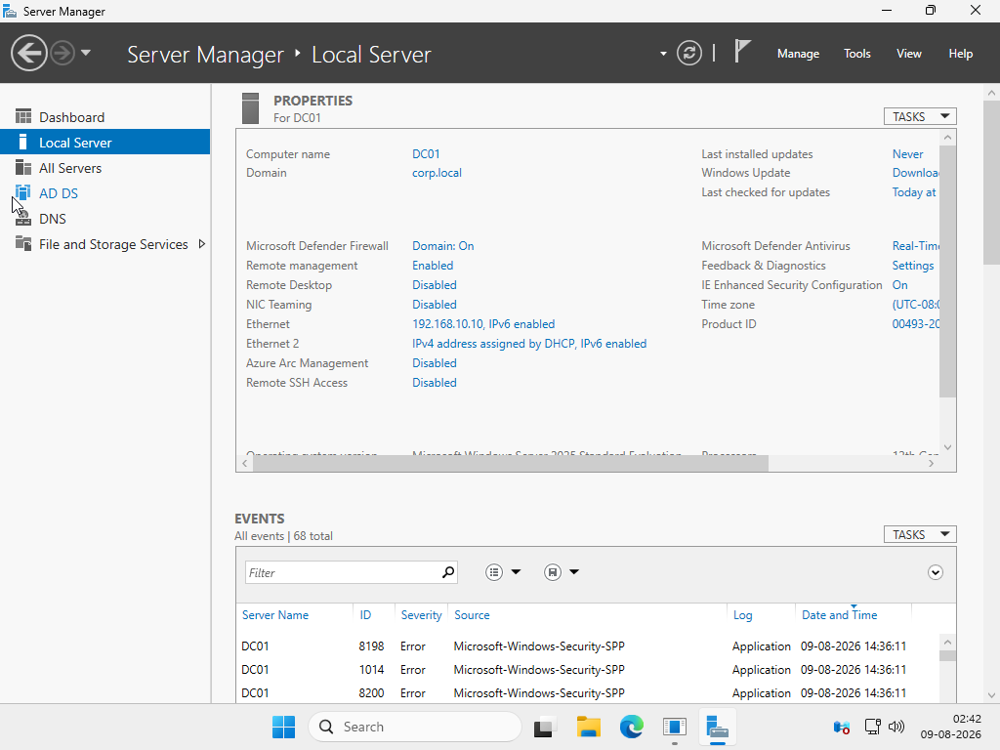

<em>Figure 3 — Domain Configuration</em>

<h3>4.4 Domain Controller & Active Directory</h3>

<strong>What was done:</strong> Configured Active Directory Domain Services and the server as the Domain Controller.

<strong>Why it matters:</strong> The Domain Controller provides centralized directory services and authentication for the Windows domain.

<strong>Evidence:</strong>

  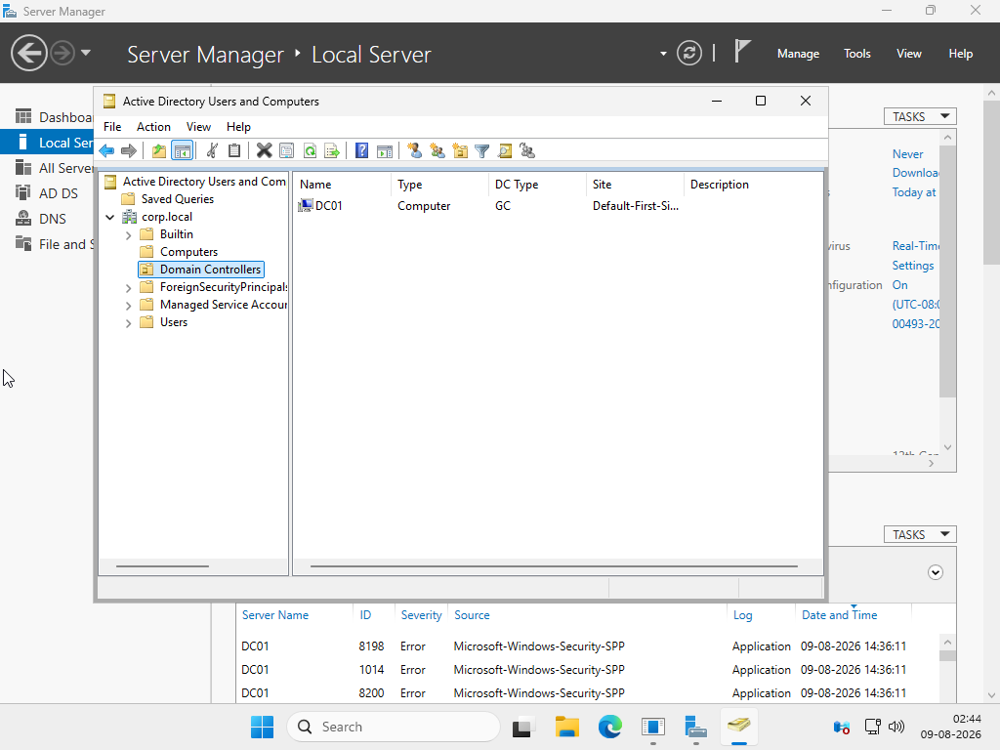

<em>Figure 4 — Active Directory Domain Controller</em>

<h3>4.5 DNS Configuration</h3>

<strong>What was done:</strong> Configured and verified the <code>corp.local</code> DNS zone.

<strong>Why it matters:</strong> DNS is a critical dependency of Active Directory because domain services rely on name resolution to locate resources and services.

<strong>Evidence:</strong>

  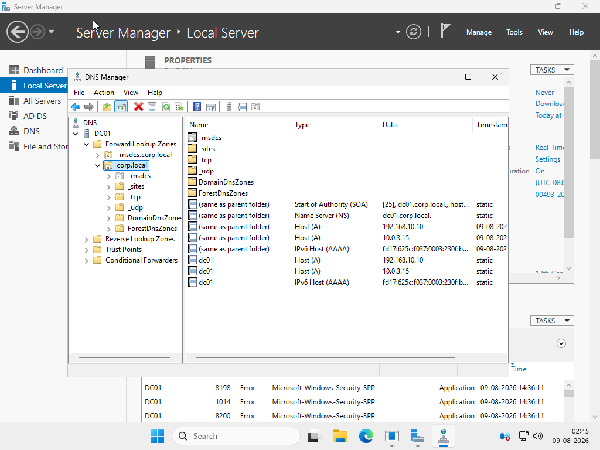

<em>Figure 5 — DNS corp.local Zone</em>

<h3>4.6 Organizational Units</h3>

<strong>What was done:</strong> Created department-based Organizational Units.

<pre>
corp.local
├── IT
├── HR
├── Finance
├── Sales
└── Management
</pre>

<strong>Why it matters:</strong> OUs provide logical organization and make future administration and Group Policy management easier.

<strong>Evidence:</strong>

  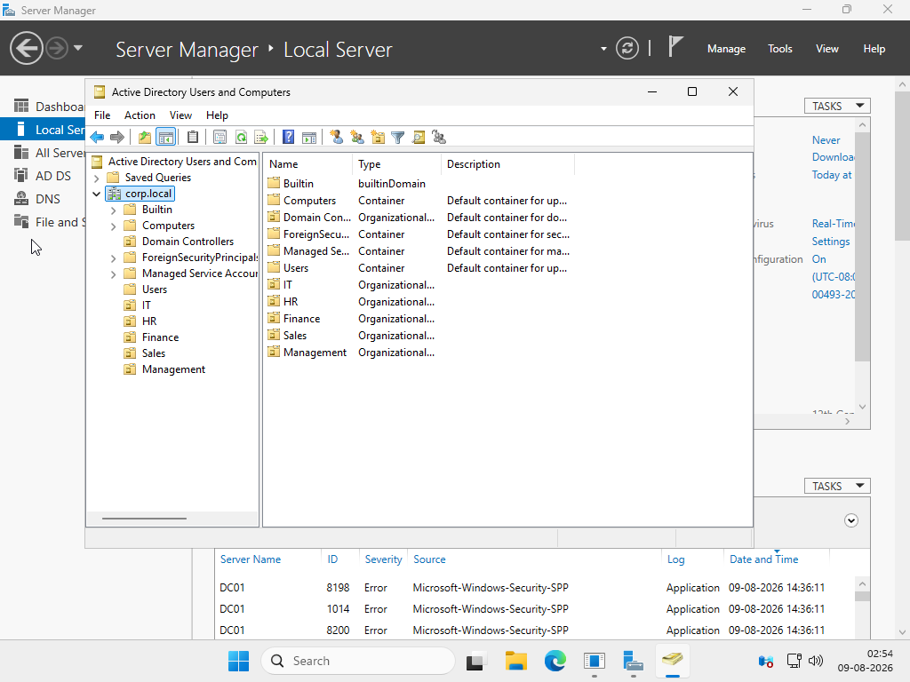

<em>Figure 6 — Departmental Organizational Units</em>

<h3>4.7 Security Groups & Group Membership</h3>

<strong>What was done:</strong> Created department-based security groups and assigned users to the appropriate groups.

<pre>
GG-IT-Users
GG-HR-Users
GG-Finance-Users
GG-Sales-Users
GG-Management-Users
</pre>

<strong>Why it matters:</strong> Group-based permissions scale better than assigning resource permissions individually to every employee.

<strong>Access model:</strong>

<pre>
User
  ↓
Department Security Group
  ↓
Department Resource
</pre>

<strong>Evidence A — IT Group Membership:</strong>

  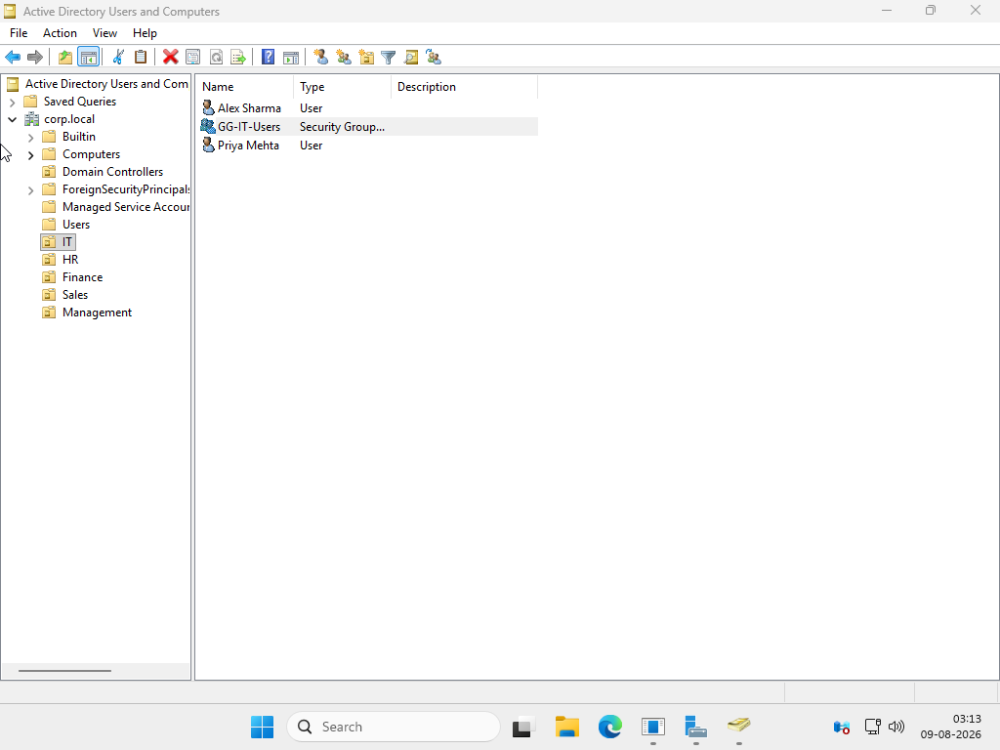

<em>Figure 7 — IT Security Group Membership</em>

<strong>Evidence B — Security Groups:</strong>

  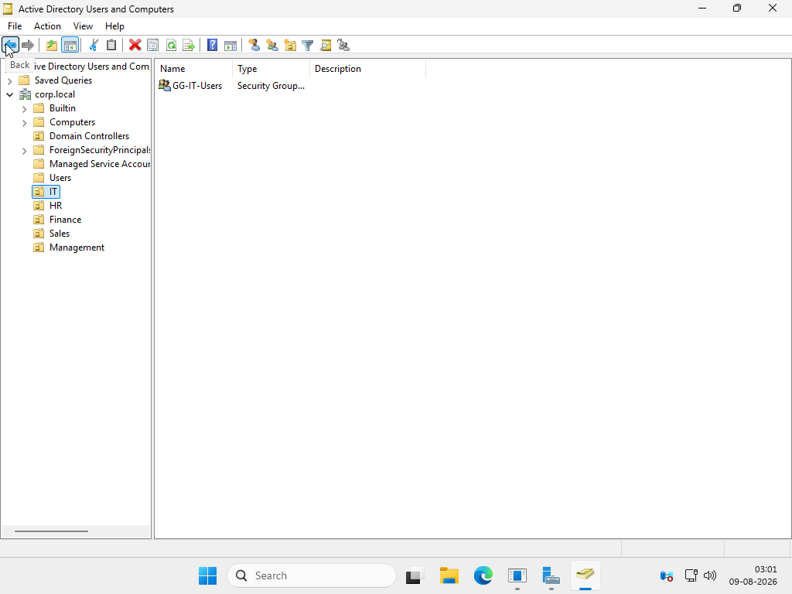

<em>Figure 8 — Department Security Groups</em>

<h3>4.8 Domain Password Policy</h3>

<strong>What was done:</strong> Configured centralized password controls including minimum password length, password complexity, and maximum password age.

<strong>Why it matters:</strong> Centralized policy ensures authentication requirements are consistently enforced across the domain.

<strong>Evidence:</strong>

  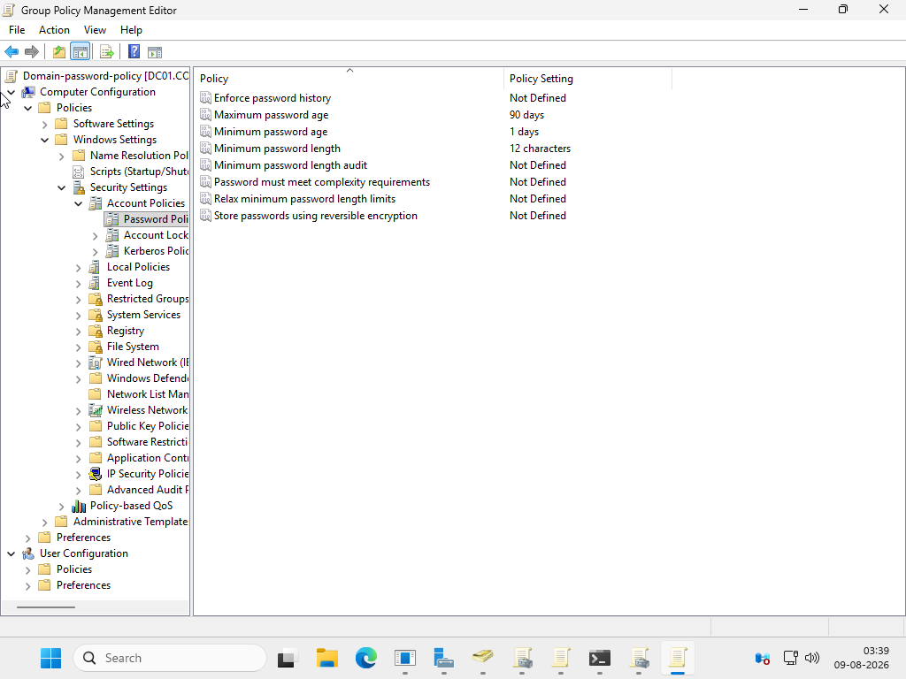

<em>Figure 9 — Domain Password Policy</em>

<h3>4.9 Account Lockout Policy</h3>

<strong>What was done:</strong> Configured account-lockout controls to protect domain accounts from repeated failed authentication attempts.

<strong>Why it matters:</strong> Account lockout is a basic defensive control against password guessing and repeated authentication attempts.

<strong>Evidence:</strong>

  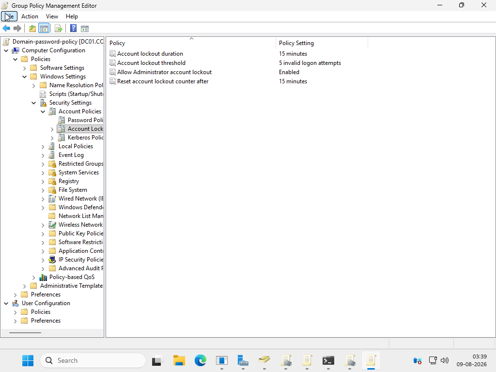

<em>Figure 10 — Account Lockout Policy</em>

<h3>4.10 Departmental File Server</h3>

<strong>What was done:</strong> Created a centralized departmental storage structure.

<pre>
C:\CompanyData
├── IT
├── HR
├── Finance
├── Sales
└── Management
</pre>

<strong>Why it matters:</strong> Departmental separation provides a structured foundation for controlling access to organization-specific data.

<h3>4.11 NTFS Permissions</h3>

<strong>What was done:</strong> Configured NTFS permissions using security groups.

<pre>
GG-IT-Users
      ↓
IT Department Folder
      ↓
Required Access
</pre>

<strong>Why it matters:</strong> Group-based permissions improve scalability and support the principle of least privilege.

<strong>Evidence:</strong>

  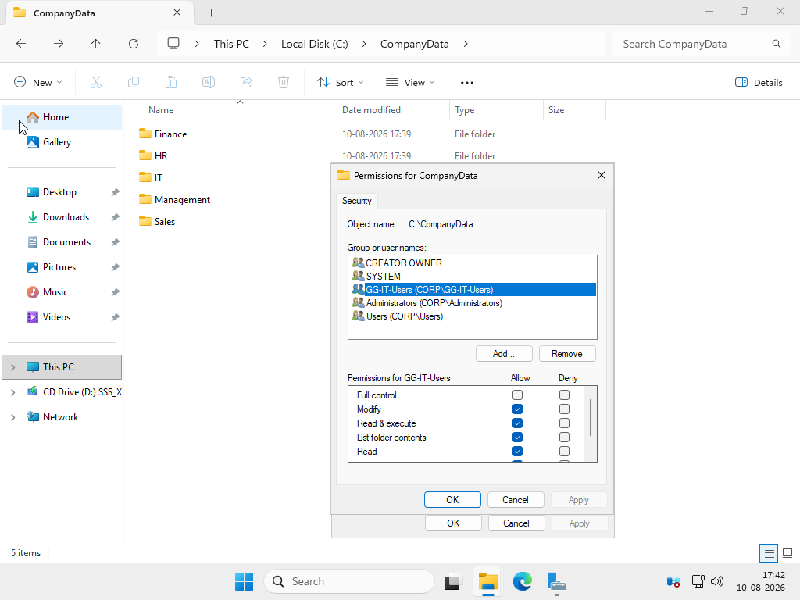

<em>Figure 11 — NTFS IT Group Permissions</em>

<h3>4.12 SMB File Share</h3>

<strong>What was done:</strong> Configured the IT departmental folder as an SMB network share.

<pre>
\\DC01\IT
</pre>

<strong>Why it matters:</strong> SMB allows authorized Windows users to access shared departmental resources over the network.

<strong>Evidence:</strong>

  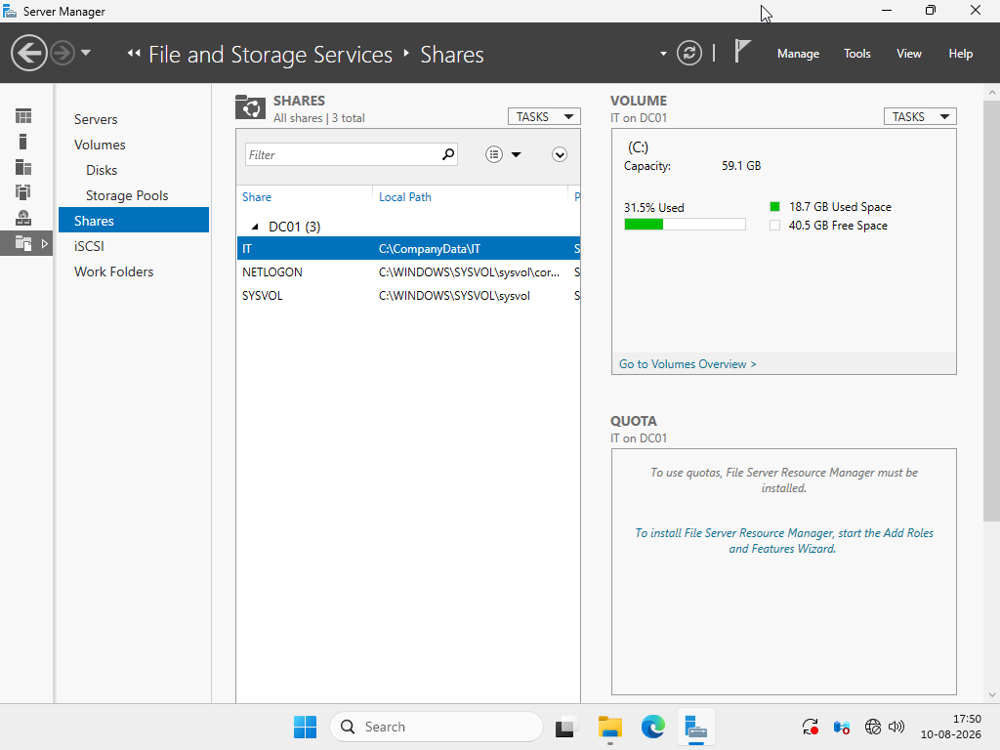

<em>Figure 12 — IT File Server Share</em>

<h3>4.13 Share Access Verification</h3>

<strong>What was done:</strong> Verified the IT share locally using <code>\\localhost\IT</code>.

<strong>Why it matters:</strong> This confirms that the configured SMB share is reachable from the server.

<strong>Evidence:</strong>

  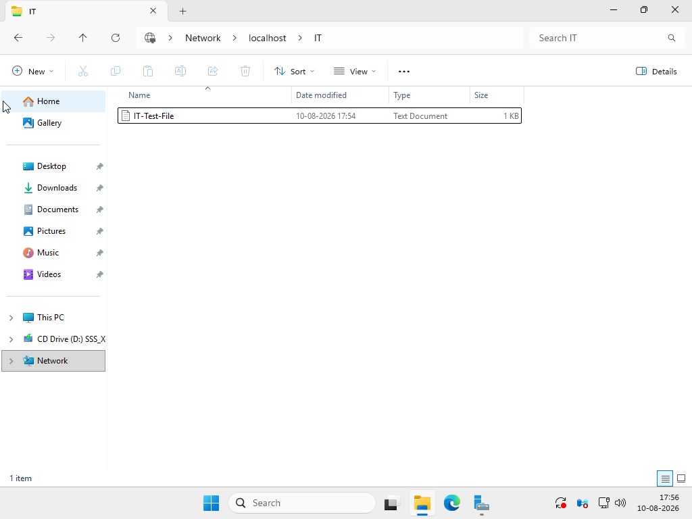

<em>Figure 13 — IT Share Access Verification</em>

<h3>4.14 Test User & Group Assignment</h3>

<strong>What was done:</strong> Verified the IT test user's membership in the IT security group.

<pre>
IT Test User
      ↓
GG-IT-Users
      ↓
IT Department Resources
</pre>

<strong>Why it matters:</strong> This demonstrates the relationship between user identity, security-group membership, and department-level resource access.

<strong>Evidence:</strong>

  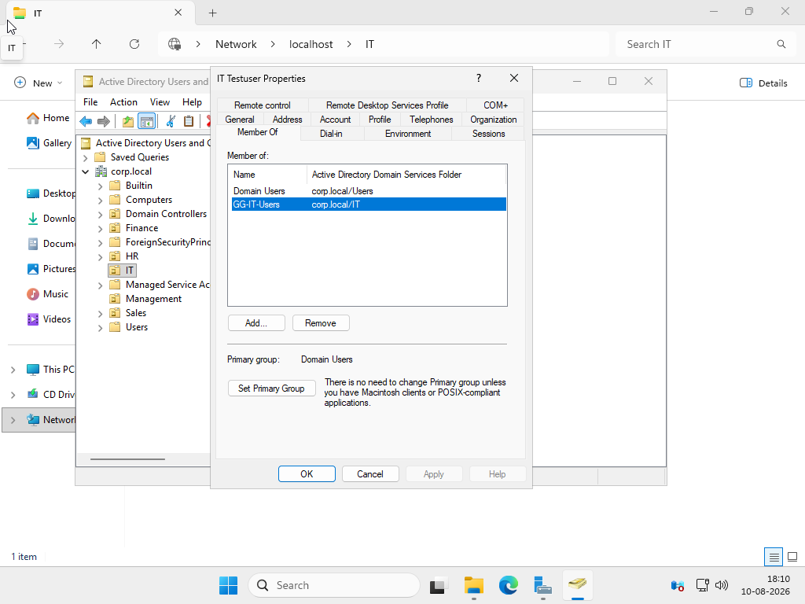

<em>Figure 14 — IT Test User Group Membership</em>

<h2>5. Security Controls Demonstrated</h2>

<table>
<tr><th>Security Control</th><th>Implementation</th></tr>
<tr><td><strong>Centralized Identity</strong></td><td>Active Directory Domain Services</td></tr>
<tr><td><strong>Group-Based Access Control</strong></td><td>Department security groups</td></tr>
<tr><td><strong>Least Privilege</strong></td><td>Department-specific NTFS permissions</td></tr>
<tr><td><strong>Password Security</strong></td><td>Domain password policy</td></tr>
<tr><td><strong>Account Protection</strong></td><td>Account lockout policy</td></tr>
<tr><td><strong>Resource Separation</strong></td><td>Departmental folders and shares</td></tr>
<tr><td><strong>Centralized Administration</strong></td><td>Active Directory and Group Policy</td></tr>
</table>

<h2>6. Troubleshooting Experience</h2>

<h3>6.1 VirtualBox Driver / Service Issue</h3>

A VirtualBox host-driver/service error prevented virtual machines from starting correctly.
The issue was investigated using Windows command-line and service checks and resolved so
the virtual machines could run again.

<h3>6.2 Windows Client Deployment</h3>

The Windows client VM encountered boot and installation problems involving UEFI,
Secure Boot, and Windows setup requirements. The client deployment was not counted
as a completed project feature; the completed project focuses on the Windows Server
infrastructure.

<h2>7. Technologies & Tools</h2>

<table>
<tr><th>Technology / Tool</th><th>Purpose</th></tr>
<tr><td>Windows Server</td><td>Core server infrastructure</td></tr>
<tr><td>Active Directory Domain Services</td><td>Centralized identity and directory management</td></tr>
<tr><td>DNS</td><td>Domain name resolution</td></tr>
<tr><td>Group Policy</td><td>Centralized security policy</td></tr>
<tr><td>NTFS</td><td>File-system access control</td></tr>
<tr><td>SMB</td><td>Windows network file sharing</td></tr>
<tr><td>PowerShell</td><td>Windows administration and troubleshooting</td></tr>
<tr><td>Command Prompt</td><td>System and network troubleshooting</td></tr>
<tr><td>Oracle VirtualBox</td><td>Virtual lab environment</td></tr>
</table>

<h2>8. Skills Demonstrated</h2>

<ul>
  <li>Windows Server Administration</li>
  <li>Active Directory Administration</li>
  <li>DNS Management</li>
  <li>User & Security Group Management</li>
  <li>Organizational Unit Design</li>
  <li>Group Policy Configuration</li>
  <li>File Server Administration</li>
  <li>NTFS Permission Management</li>
  <li>SMB Share Configuration</li>
  <li>Access Control</li>
  <li>Infrastructure Troubleshooting</li>
  <li>Technical Documentation</li>
</ul>

<h2>9. Real-World Relevance</h2>

<ol>
  <li>Centralize employee identity with Active Directory.</li>
  <li>Organize employees by department using OUs.</li>
  <li>Manage resource access through security groups.</li>
  <li>Enforce authentication security policies centrally.</li>
  <li>Provide departmental shared storage.</li>
  <li>Apply NTFS permissions according to job requirements.</li>
  <li>Verify access and infrastructure configuration.</li>
  <li>Troubleshoot Windows infrastructure issues.</li>
</ol>

<h2>10. Project Scope</h2>

This is a self-built lab environment created for hands-on learning and portfolio demonstration.
Only configurations and results that were actually completed and verified during the lab are
presented as implemented.

The unfinished bulk PowerShell user-provisioning automation and unsuccessful Windows client
deployment are intentionally not presented as completed features.

<h2>11. Author</h2>

<strong>Mohammed Aleem Hasan</strong> 
BCA Student • Aspiring IT Support / System & Network Administrator

  <strong>Windows Server • Active Directory • DNS • Group Policy • File Server • Access Control</strong>

